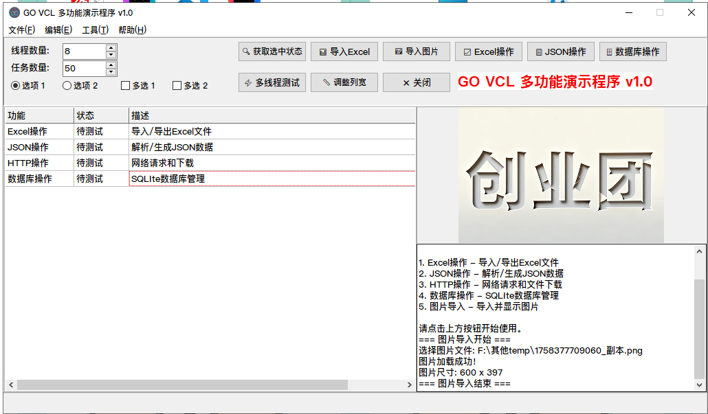

# GO_VCL Windows GUI应用程序

[](https://github.com/yuan71058/GO_VCL/releases)
[](https://opensource.org/licenses/MIT)
[](https://golang.org)
[](https://www.microsoft.com/windows)

GO_VCL是一个功能丰富的Windows桌面GUI应用程序，基于Go语言和Govcl UI框架开发，集成了Excel处理、JSON操作、HTTP请求和数据库管理等多种功能，提供直观易用的图形界面。

## 📸 功能展示



## 🌟 主要功能

- 📊 **Excel操作** - 导入导出xlsx格式文件，支持批量数据处理
- 🔧 **JSON操作** - 解析、验证和格式化JSON数据，支持JSONPath查询
- 🌐 **HTTP网络操作** - 支持GET/POST/PUT/DELETE请求，文件下载和自定义请求头
- 💾 **数据库操作** - 完整的SQLite数据库管理，支持CRUD操作
- 🖼️ **图像处理** - 导入并显示多种格式的图片，带美观边框效果
- 🌐 **TCP服务器** - 支持多客户端连接，UTF-8编码通信，消息广播
- 🌐 **Web服务器** - 提供RESTful API和WebSocket实时双向通信
- ⚡ **高级特性** - 多线程支持，独立部署，UPX压缩优化

## 🚀 快速开始

### 下载安装

1. 访问 [发布页面](https://github.com/yuan71058/GO_VCL/releases)
2. 下载最新版本的 `windows-gui-app.exe`
3. 双击运行，无需安装

### 系统要求

- Windows 10/11 (x64)
- 最少512MB可用内存
- 至少20MB可用空间

### 从源码构建

```bash
# 克隆仓库
git clone https://github.com/yuan71058/GO_VCL.git
cd GO_VCL

# 安装依赖
go mod tidy

# 构建程序
go build -tags tempdll -ldflags "-w -s -H=windowsgui" -o dist/windows-gui-app.exe

# 或使用提供的构建脚本
.\build_and_run.bat
```

## 📖 使用指南

### 主界面组件

- **顶部菜单栏**: 文件、编辑、工具、帮助菜单
- **左侧按钮区**: 各功能模块的操作按钮
- **中央表格区**: 数据显示和编辑区域
- **右侧图片区**: 图片导入和显示区域
- **底部配置区**: 单选框、多选框等配置选项
- **底部状态栏**: 操作状态和结果信息

### 功能操作

#### Excel操作
1. 点击"📊 Excel"按钮
2. 使用"📥 导入Excel"选择xlsx文件
3. 数据自动显示在表格区域
4. 支持编辑和导出功能

#### JSON操作
1. 点击"🔧 JSON"按钮
2. 输入或粘贴JSON数据
3. 程序自动解析并验证格式
4. 支持格式化和保存

#### HTTP请求
1. 点击"🌐 HTTP"按钮
2. 输入URL和选择请求方法
3. 添加自定义请求头和参数
4. 查看服务器响应和状态码

#### 数据库操作
1. 点击"💾 数据库"按钮
2. 程序自动创建或连接SQLite数据库
3. 执行CRUD操作
4. 查询结果显示在表格区域

#### TCP服务器
1. 点击"🔌 TCP服务"启动服务器
2. 默认监听端口8082
3. 使用"📡 连接TCP"连接服务器
4. 使用"📤 发送数据"发送消息
5. 支持多客户端同时连接

#### Web服务器
1. 点击"🌐 Web服务器"启动服务器
2. HTTP服务默认监听端口8080
3. WebSocket服务默认监听端口8081
4. 提供RESTful API接口
5. 支持实时双向WebSocket通信

## 🛠️ 技术架构

### 核心技术
- **Go语言**: 高性能、类型安全的编程语言
- **Govcl框架**: 跨平台的VCL GUI框架
- **SQLite**: 轻量级嵌入式数据库
- **Excelize**: 高性能Excel文件处理库
- **GJSON**: 高效JSON解析库
- **HttpRequest**: 简洁易用的HTTP客户端库

### 架构设计
- **分层架构**: UI层、业务逻辑层、数据访问层清晰分离
- **模块化设计**: 各功能模块独立开发和维护，降低耦合度
- **事件驱动**: 基于事件处理机制的用户交互模式
- **管理器模式**: 使用专门的管理器类处理各功能模块

## 📁 项目结构

```
GO_VCL/
├── main.go                      # 程序入口文件
├── ui/
│   └── MainForm.go              # 主窗口界面实现
├── managers/                    # 功能管理器模块
│   ├── excel_manager.go         # Excel操作管理器
│   ├── json_manager.go          # JSON操作管理器
│   ├── http_manager.go          # HTTP操作管理器
│   ├── database_manager.go      # 数据库操作管理器
│   ├── concurrent_manager.go    # 并发任务管理器
│   ├── tcp_server_manager.go    # TCP服务器管理器
│   ├── webserver_manager.go     # Web服务器管理器
│   └── skin_manager.go          # 皮肤管理器
├── test/                        # 测试文件目录
│   └── test_tcp_client.go       # TCP客户端测试
├── docs/                        # 文档目录
├── dist/                        # 构建输出目录
└── 说明文档.md                   # 项目详细说明文档
```

## 📋 版本历史

### v1.3.2 (2025-11-14)
- **TCP服务器功能增强**：修复TCP服务器停止后再次启动出现乱码的问题
- **UTF-8编码支持**：为TCP服务器添加UTF-8编码处理，确保中文字符正确传输
- **Web服务器功能**：新增Web服务器功能，支持HTTP和WebSocket服务
- **API接口完善**：提供RESTful API接口，支持状态查询和客户端管理
- **文档更新**：添加TCP服务器和Web服务器功能文档，完善用户指南

### v1.3.1 (2025-11-12)
- 项目结构优化：清理无用文件和脚本，删除重复文件
- 皮肤文件管理：将皮肤文件迁移到dist目录，统一管理
- 批处理脚本优化：保留最终版本，删除冗余脚本
- 文档更新：更新项目说明文档，记录最新清理工作

### v1.3.0 (2025-11-12)
- **代码清理与优化**
  - 删除未使用的handlers/button_handlers.go文件（675行代码）
  - 将所有事件处理逻辑整合到MainForm结构体中
  - 简化项目结构，提高代码内聚性
  - 更新项目文档，保持文档与代码同步
- **架构优化**
  - 采用更直接的事件处理方式
  - 减少不必要的抽象层
  - 提高代码可维护性

### v1.2.0 (2025-11-12)
- **界面优化与美化**
  - 优化界面布局和控件排列
  - 添加图标和美化界面元素
  - 改进用户体验
- **功能增强**
  - 完善单选框和多选框功能
  - 增强菜单功能
  - 添加图片导入功能
- **技术改进**
  - 将liblcl.dll嵌入到可执行文件中
  - 添加UPX压缩支持
  - 优化构建脚本

### v1.1.0 (2025-11-11)
- **多线程支持**
  - 添加并发任务管理器
  - 支持HTTP、计算、I/O和混合并发任务
  - 实现任务进度监控
- **数据库功能增强**
  - 完善数据库操作功能
  - 添加事务支持
  - 修复索引越界问题
- **错误处理改进**
  - 添加全局错误处理机制
  - 改进异常信息显示

### v1.0.0 (2025-11-10)
- **初始版本发布**
  - 实现基本的Excel操作功能
  - 实现基本的JSON操作功能
  - 实现基本的HTTP操作功能
  - 实现基本的数据库操作功能
  - 创建基本的GUI界面

## 🤝 贡献指南

我们欢迎社区贡献！如果您想为项目做出贡献，请遵循以下步骤：

1. Fork本项目到您的GitHub账户
2. 创建功能分支 (`git checkout -b feature/AmazingFeature`)
3. 提交您的更改 (`git commit -m 'Add some AmazingFeature'`)
4. 推送到分支 (`git push origin feature/AmazingFeature`)
5. 创建Pull Request

### 代码贡献规范

- 遵循现有的代码风格和命名约定
- 为新功能添加适当的注释和文档
- 确保所有测试通过
- 提交信息应清晰描述更改内容

## 📄 许可证

本项目基于MIT许可证开源，详情请参阅[LICENSE](LICENSE)文件。

## 👨‍💻 作者

**yuan71058** - *项目所有者* - [GitHub](https://github.com/yuan71058)

## 📞 联系支持

如有问题或建议，请通过以下方式联系：

- **GitHub Issues**: [提交问题](https://github.com/yuan71058/GO_VCL/issues)
- **项目主页**: [GitHub仓库](https://github.com/yuan71058/GO_VCL)
- **发布页面**: [GitHub Releases](https://github.com/yuan71058/GO_VCL/releases)

## 🙏 致谢

感谢以下开源项目和贡献者：

- [Govcl](https://github.com/ying32/govcl) - Go语言的VCL绑定
- [Excelize](https://github.com/qax-os/excelize) - Go语言Excel处理库
- [GJSON](https://github.com/tidwall/gjson) - Go语言JSON解析库
- [HttpRequest](https://github.com/kirinlabs/HttpRequest) - Go语言HTTP客户端
- [Go-SQLite3](https://github.com/mattn/go-sqlite3) - Go语言SQLite驱动

---

<div align="center">
  <p>© 2025 GO_VCL Windows GUI应用程序. 保留所有权利.</p>
  <p>使用 ❤️ 和 Go 语言构建</p>
  <p><strong>最后更新</strong>: 2025-11-14 (v1.3.2)</p>
</div>