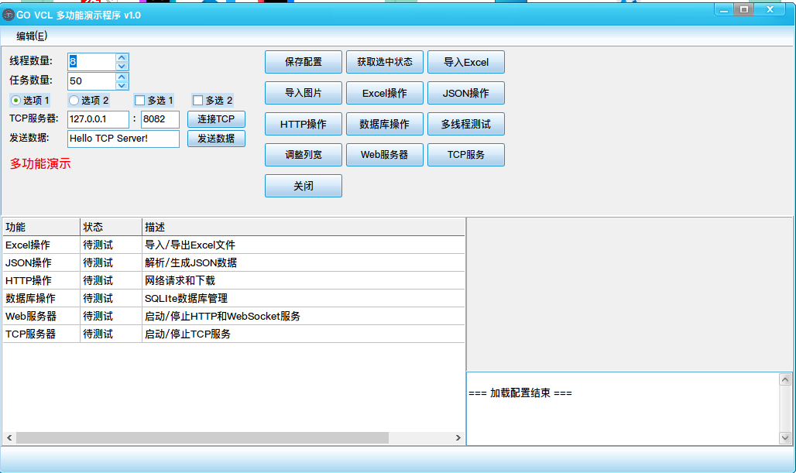

# README.md 图片添加指南

本指南介绍如何在README.md中添加和展示图片。

## 基本语法

### 1. 基本图片语法
```markdown

```

### 2. 带标题的图片
```markdown

```

### 3. 设置图片大小
```markdown

```

### 4. 居中显示图片
```markdown
<p align="center">
  
</p>
```

### 5. 并排显示多张图片
```markdown
<table>
  <tr>
    <td></td>
    <td></td>
  </tr>
</table>
```

## 项目中的图片文件

当前项目中的图片文件：

1. `image.png` - 应用程序界面截图
2. `rgb.ico` - 应用程序图标

## Screenshots目录

项目已创建`screenshots/`目录用于存放功能截图：

1. `main-ui.png` - 应用程序主界面截图（待添加）
2. `excel-operation.png` - Excel文件导入功能截图（待添加）
3. `database-operation.png` - 数据库查询功能截图（待添加）

注意：当前这些是示例文件名，实际截图需要后续添加。

## 添加新图片的步骤

1. **准备图片文件**
   - 将图片文件放在项目根目录或创建专门的图片目录
   - 建议使用PNG或JPG格式的截图
   - 图片大小建议控制在1MB以内

2. **在README.md中添加图片引用**
   - 确定图片要插入的位置
   - 使用适当的语法添加图片引用
   - 添加有意义的替代文本和标题

3. **提交更改**
   ```bash
   git add README.md 图片文件
   git commit -m "添加功能截图"
   git push origin main
   ```

## 最佳实践

1. **图片命名**
   - 使用有意义的文件名
   - 避免使用空格和特殊字符
   - 使用小写字母和连字符

2. **图片大小**
   - 截图宽度建议在800-1200像素之间
   - 高度根据内容自适应
   - 可以在Markdown中指定显示大小

3. **替代文本**
   - 为图片添加描述性的替代文本
   - 替代文本应该简洁但信息丰富
   - 这有助于提高可访问性

4. **图片组织**
   - 对于大量图片，可以创建专门的目录
   - 例如：`docs/images/`或`screenshots/`
   - 在README.md中使用相对路径引用

## 示例代码

以下是一些常用的图片展示代码示例：

### 功能截图展示
```markdown
## 功能展示

### 主界面


### Excel操作


### 数据库操作

```

### 响应式图片展示
```markdown
<p align="center">
  
</p>
```

### 功能对比展示
```markdown
<table>
  <tr>
    <th>功能A</th>
    <th>功能B</th>
  </tr>
  <tr>
    <td></td>
    <td></td>
  </tr>
</table>
```

## 注意事项

1. GitHub对图片大小有限制，单个文件不超过25MB
2. 图片路径区分大小写，确保路径正确
3. 提交时记得同时添加图片文件和README.md的更改
4. 如果图片无法显示，检查路径和文件名是否正确

## 使用在线图片

除了本地图片，也可以使用在线图片服务：

```markdown

```

但建议优先使用项目内的图片，确保长期可用性。