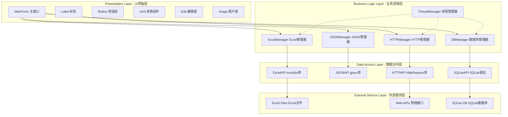
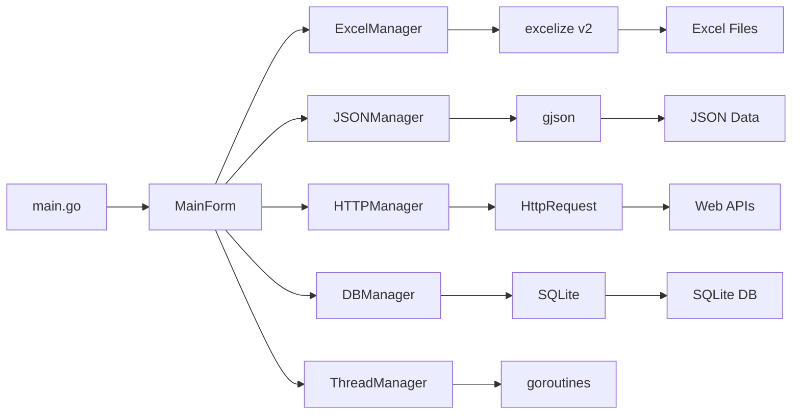
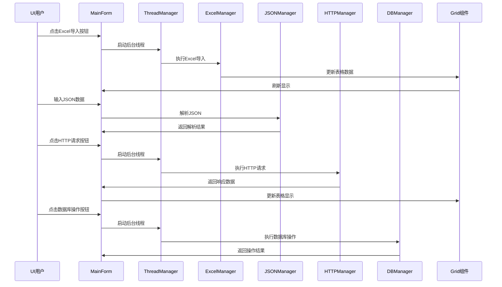

# DESIGN_windows_gui_app.md

## 系统架构图



## 分层设计和核心组件

### 1. Presentation Layer（UI界面层）
- **MainForm**: 主窗口容器，包含所有UI组件的布局管理
- **Label**: 显示状态信息和结果反馈
- **Button**: 功能触发按钮（Excel导入/导出、JSON操作、HTTP请求、DB操作）
- **Grid**: 数据展示表格，支持与外部数据源双向同步
- **Edit**: 文本编辑框，用于输入参数和显示结果
- **Image**: 图片显示框，展示网络图片或本地图片

### 2. Business Logic Layer（业务逻辑层）
- **ExcelManager**: 封装Excel文件读写操作，提供UI友好的接口
- **JSONManager**: 处理JSON数据的解析、生成和验证
- **HTTPManager**: 管理HTTP请求的发送和响应处理
- **DBManager**: SQLite数据库的连接、表管理和CRUD操作
- **ThreadManager**: 线程池管理，确保UI操作在主线程执行

### 3. Data Access Layer（数据访问层）
- **ExcelAPI**: 封装excelize库的底层调用
- **JSONAPI**: 封装gjson库的功能调用
- **HTTPAPI**: 封装HttpRequest库的HTTP操作
- **SQLiteAPI**: 封装SQLite数据库驱动

## 模块依赖关系图



## 接口契约定义

### 1. ExcelManager接口
```go
type ExcelManager interface {
    ImportExcel(filePath string) ([][]string, error)     // 从Excel文件导入数据
    ExportExcel(data [][]string, filePath string) error   // 导出数据到Excel
    LoadFromGrid(gridData [][]string) error              // 从UI表格加载数据
    SaveToGrid() ([][]string, error)                     // 保存数据到UI表格
}
```

### 2. JSONManager接口
```go
type JSONManager interface {
    ParseJSON(jsonStr string) (map[string]interface{}, error)      // 解析JSON字符串
    GenerateJSON(data map[string]interface{}) (string, error)     // 生成JSON字符串
    GetValueByPath(jsonStr, path string) (interface{}, error)     // 根据路径获取JSON值
    SetValueByPath(jsonStr, path, value string) (string, error)   // 设置JSON值
}
```

### 3. HTTPManager接口
```go
type HTTPManager interface {
    Get(url string) (string, error)               // HTTP GET请求
    Post(url, data string) (string, error)        // HTTP POST请求
    DownloadFile(url, filePath string) error      // 下载文件
    GetWithHeaders(url string, headers map[string]string) (string, error) // 带请求头的GET
}
```

### 4. DBManager接口
```go
type DBManager interface {
    Connect(dbPath string) error                          // 连接数据库
    CreateTable(tableName string, columns []string) error // 创建表
    Insert(tableName string, data map[string]interface{}) error // 插入数据
    Query(tableName, query string) ([]map[string]interface{}, error) // 查询数据
    Update(tableName string, data map[string]interface{}, where string) error // 更新数据
    Delete(tableName string, where string) error          // 删除数据
}
```

## 数据流向图



## 异常处理策略

### 1. UI线程安全
- 所有UI更新操作通过`govcl.Application.Sync()`执行
- 后台线程只处理数据，不直接操作UI组件
- 使用通道(Channel)传递线程间的消息

### 2. 错误处理分级
- **Level 1**: UI级别错误（用户友好的错误消息）
- **Level 2**: 业务逻辑错误（日志记录+用户提示）
- **Level 3**: 系统级错误（异常捕获+程序退出）

### 3. 异常恢复机制
```go
// 线程安全执行
func SafeExecute(fn func()) {
    govcl.Application.Sync(func() {
        defer func() {
            if r := recover(); r != nil {
                log.Printf("Panic recovered: %v", r)
                govcl.MessageBox("操作失败，请重试", "错误", 
                    govcl.MB_OK|govcl.MB_ICONERROR)
            }
        }()
        fn()
    })
}
```

## UI布局设计

### 主窗口布局
```
┌─────────────────────────────────────────────────────────────────────┐
│ GO VCL 多功能演示程序                                        │ ← 标题栏
├─────────────────────────────────────────────────────────────────────┤
│  状态栏: 就绪 | 操作: 等待用户输入                    │ ← 状态栏
├─────────────────────────────────────────────────────────────────────┤
│                                                                    │
│  ┌─────────────────┐  ┌─────────────────────────────────────────┐  │
│  │   标签区域       │  │            主要内容区域                │  │
│  │               │  │                                         │  │
│  │ Label1:状态    │  │  ┌─────────────────┐ ┌─────────────────┐  │  │
│  │ Label2:计数    │  │  │   按钮面板       │ │    表格组件       │  │  │
│  │               │  │  │                 │ │                 │  │  │
│  │               │  │  │ [Excel导入]     │ │ ┌─────────────┐ │  │  │
│  │               │  │  │ [Excel导出]     │ │ │    Grid     │ │  │  │
│  │               │  │  │ [JSON解析]     │ │ │             │ │  │  │
│  │               │  │  │ [HTTP请求]     │ │ │             │ │  │  │
│  │               │  │  │ [数据库操作]   │ │ │             │ │  │  │
│  │               │  │  │                 │ │ └─────────────┘ │  │  │
│  └─────────────────┘  │ └─────────────────┘ └─────────────────┘  │  │
│                                                                    │
│  ┌─────────────────┐  ┌─────────────────────────────────────────┐  │
│  │   编辑区域       │  │            日志输出区域                 │  │
│  │               │  │                                         │  │
│  │ [Edit输入框]    │  │ [Log输出框 - 多行文本]                 │  │
│  │               │  │                                         │  │
│  │               │  │                                         │  │
│  │               │  │                                         │  │
│  └─────────────────┘  └─────────────────────────────────────────┘  │
│                                                                    │
└─────────────────────────────────────────────────────────────────────┘
```

### 组件规格说明
- **主窗口**: 800x600像素，可调整大小
- **标签区域**: 200x100像素，显示应用状态
- **按钮面板**: 180x400像素，包含5个功能按钮
- **表格组件**: 580x350像素，支持滚动和选择
- **编辑区域**: 200x100像素，单行文本输入
- **日志输出**: 580x100像素，多行文本显示