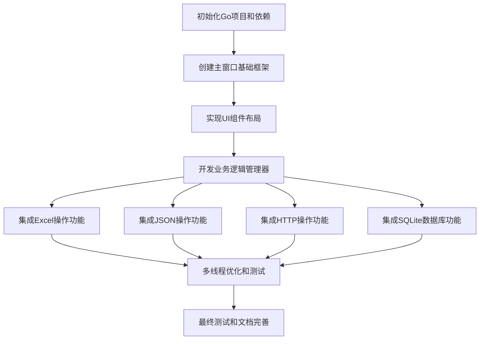

# TASK_windows_gui_app.md

## 项目总体任务依赖图

## 原子任务详细清单

### 任务1: 项目初始化和环境配置
**任务ID**: TASK001  
**优先级**: 高  
**复杂度**: 低

#### 输入契约
- 前置依赖: 无
- 输入数据: 无
- 环境依赖: Windows系统、Go 1.9+、liblcl.dll文件

#### 输出契约
- 输出数据: go.mod文件、项目目录结构
- 交付物: 可编译的Go项目框架
- 验收标准: 
  - go mod init命令成功执行
  - 所有依赖库版本正确锁定
  - 项目结构符合模块化设计

#### 实现约束
- 技术栈: Go modules
- 接口规范: 使用语义化版本
- 质量要求: 最小化依赖，版本锁定

#### 依赖关系
- 后置任务: TASK002
- 并行任务: 无
- 阻塞关系: 无

---

### 任务2: 创建主窗口基础框架
**任务ID**: TASK002  
**优先级**: 高  
**复杂度**: 中

#### 输入契约
- 前置依赖: TASK001完成
- 输入数据: 无
- 环境依赖: govcl库、liblcl.dll

#### 输出契约
- 输出数据: MainForm主窗口程序
- 交付物: 可显示的窗口框架
- 验收标准:
  - 窗口成功创建并显示
  - 窗口尺寸800x600
  - 标题显示"GO VCL 多功能演示程序"
  - 窗口可以正常关闭

#### 实现约束
- 技术栈: github.com/ying32/govcl
- 接口规范: 遵循govcl事件驱动模式
- 质量要求: 代码注释完整，包含函数说明

#### 依赖关系
- 后置任务: TASK003
- 并行任务: 无
- 阻塞关系: TASK001

---

### 任务3: 实现UI组件布局
**任务ID**: TASK003  
**优先级**: 高  
**复杂度**: 中

#### 输入契约
- 前置依赖: TASK002完成
- 输入数据: UI布局设计规范
- 环境依赖: govcl组件库

#### 输出契约
- 输出数据: 完整UI布局的窗口
- 交付物: 包含Label、Button、Grid、Edit、Image的窗口
- 验收标准:
  - 所有5种UI组件正确显示
  - 布局符合设计文档规范
  - 组件位置和尺寸准确
  - 组件基本属性设置正确

#### 实现约束
- 技术栈: govcl组件(TRzLabel, TButton, TStringGrid, TEdit, TImage)
- 接口规范: 组件属性设置和事件绑定
- 质量要求: 所有组件添加属性注释

#### 依赖关系
- 后置任务: TASK004
- 并行任务: 无
- 阻塞关系: TASK002

---

### 任务4: 开发业务逻辑管理器
**任务ID**: TASK004  
**优先级**: 中  
**复杂度**: 高

#### 输入契约
- 前置依赖: TASK003完成
- 输入数据: 各管理器的接口定义
- 环境依赖: 无

#### 输出契约
- 输出数据: 5个管理器模块的Go代码
- 交付物: ExcelManager、JSONManager、HTTPManager、DBManager、ThreadManager
- 验收标准:
  - 每个管理器实现完整接口
  - 代码结构清晰，职责单一
  - 包含完整的函数注释
  - 提供错误处理机制

#### 实现约束
- 技术栈: 纯Go代码
- 接口规范: 遵循面向接口编程
- 质量要求: 函数级注释必须完整

#### 依赖关系
- 后置任务: TASK005, TASK006, TASK007, TASK008
- 并行任务: 无
- 阻塞关系: TASK003

---

### 任务5: 集成Excel操作功能
**任务ID**: TASK005  
**优先级**: 中  
**复杂度**: 中

#### 输入契约
- 前置依赖: TASK004完成
- 输入数据: ExcelManager接口、excelize库
- 环境依赖: Excel文件测试数据

#### 输出契约
- 输出数据: Excel导入导出功能
- 交付物: 可执行的Excel操作功能
- 验收标准:
  - 能从Excel文件读取数据到表格组件
  - 能将表格数据导出到Excel文件
  - 支持.xlsx格式文件
  - 包含错误处理和用户反馈

#### 实现约束
- 技术栈: github.com/xuri/excelize/v2
- 接口规范: ExcelManager接口实现
- 质量要求: 多线程安全处理

#### 依赖关系
- 后置任务: TASK009
- 并行任务: TASK006, TASK007, TASK008
- 阻塞关系: TASK004

---

### 任务6: 集成JSON操作功能
**任务ID**: TASK006  
**优先级**: 中  
**复杂度**: 低

#### 输入契约
- 前置依赖: TASK004完成
- 输入数据: JSONManager接口、gjson库
- 环境依赖: JSON示例数据

#### 输出契约
- 输出数据: JSON解析和生成功能
- 交付物: 可执行的JSON操作功能
- 验收标准:
  - 能解析JSON字符串
  - 能生成JSON字符串
  - 能根据路径获取JSON值
  - 提供JSON操作示例

#### 实现约束
- 技术栈: github.com/tidwall/gjson
- 接口规范: JSONManager接口实现
- 质量要求: 字符串编码正确处理

#### 依赖关系
- 后置任务: TASK009
- 并行任务: TASK005, TASK007, TASK008
- 阻塞关系: TASK004

---

### 任务7: 集成HTTP操作功能
**任务ID**: TASK007  
**优先级**: 中  
**复杂度**: 中

#### 输入契约
- 前置依赖: TASK004完成
- 输入数据: HTTPManager接口、HttpRequest库
- 环境依赖: 网络连接、可访问的测试API

#### 输出契约
- 输出数据: HTTP GET/POST请求功能
- 交付物: 可执行的HTTP操作功能
- 验收标准:
  - 能执行HTTP GET请求
  - 能执行HTTP POST请求
  - 能处理响应数据
  - 能显示请求结果

#### 实现约束
- 技术栈: github.com/kirinlabs/HttpRequest
- 接口规范: HTTPManager接口实现
- 质量要求: 网络错误处理

#### 依赖关系
- 后置任务: TASK009
- 并行任务: TASK005, TASK006, TASK008
- 阻塞关系: TASK004

---

### 任务8: 集成SQLite数据库功能
**任务ID**: TASK008  
**优先级**: 中  
**复杂度**: 中

#### 输入契约
- 前置依赖: TASK004完成
- 输入数据: DBManager接口、SQLite驱动
- 环境依赖: 数据库文件创建权限

#### 输出契约
- 输出数据: SQLite数据库CRUD操作功能
- 交付物: 可执行的数据库操作功能
- 验收标准:
  - 能连接SQLite数据库
  - 能创建表结构
  - 能执行增删改查操作
  - 能显示查询结果

#### 实现约束
- 技术栈: modernc.org/sqlite 或 mattn/go-sqlite3
- 接口规范: DBManager接口实现
- 质量要求: SQL注入防护

#### 依赖关系
- 后置任务: TASK009
- 并行任务: TASK005, TASK006, TASK007
- 阻塞关系: TASK004

---

### 任务9: 多线程优化和功能集成
**任务ID**: TASK009  
**优先级**: 高  
**复杂度**: 高

#### 输入契约
- 前置依赖: TASK005, TASK006, TASK007, TASK008全部完成
- 输入数据: ThreadManager、各功能模块
- 环境依赖: 完整的项目代码

#### 输出契约
- 输出数据: 完整的多线程GUI应用程序
- 交付物: 可运行的多功能演示程序
- 验收标准:
  - 所有功能按钮事件正确绑定
  - 后台操作不影响UI响应
  - 线程间数据传递正确
  - 用户体验流畅

#### 实现约束
- 技术栈: goroutines + channels + govcl.Sync()
- 接口规范: 事件驱动的按钮回调
- 质量要求: 线程安全和错误恢复

#### 依赖关系
- 后置任务: TASK010
- 并行任务: 无
- 阻塞关系: TASK005, TASK006, TASK007, TASK008

---

### 任务10: 最终测试和文档完善
**任务ID**: TASK010  
**优先级**: 高  
**复杂度**: 低

#### 输入契约
- 前置依赖: TASK009完成
- 输入数据: 完整项目代码
- 环境依赖: Windows运行环境

#### 输出契约
- 输出数据: 测试报告和最终文档
- 交付物: 可执行的最终产品
- 验收标准:
  - 所有验收标准全部满足
  - 程序编译无错误
  - 功能测试全部通过
  - 文档完整准确

#### 实现约束
- 技术栈: 无
- 接口规范: 符合项目规范
- 质量要求: 零错误，完整注释

#### 依赖关系
- 后置任务: 无
- 并行任务: 无
- 阻塞关系: TASK009

---

## 任务执行策略

### 执行顺序
1. **严格串行**: TASK001 → TASK002 → TASK003 → TASK004
2. **并行执行**: TASK005, TASK006, TASK007, TASK008（可同时开发）
3. **串行汇总**: TASK009（需要所有功能模块完成）
4. **最终交付**: TASK010

### 质量门控
- 每个任务完成后立即验证
- 前置任务未完成禁止开始后置任务
- 并行任务可以独立验证
- 关键节点设置验收检查点

### 风险控制
- 复杂任务(TASK004, TASK009)预留额外时间
- 技术难点(多线程)提前准备备选方案
- 外部依赖(网络API)准备离线测试数据
- 进度偏差时调整并行任务数量